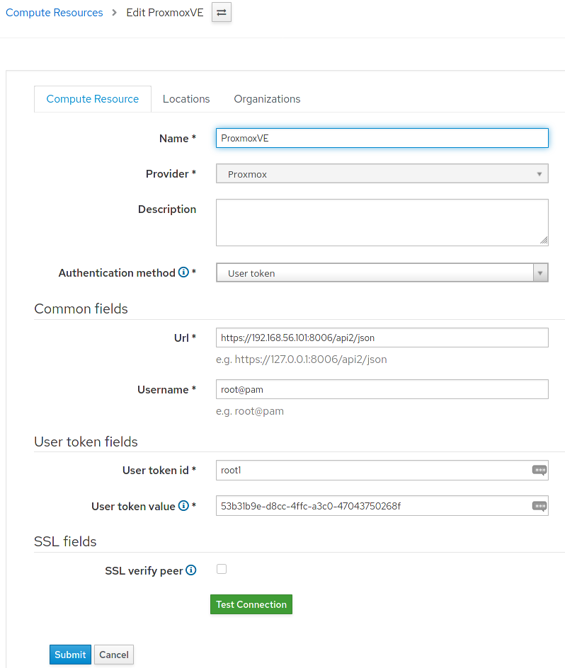
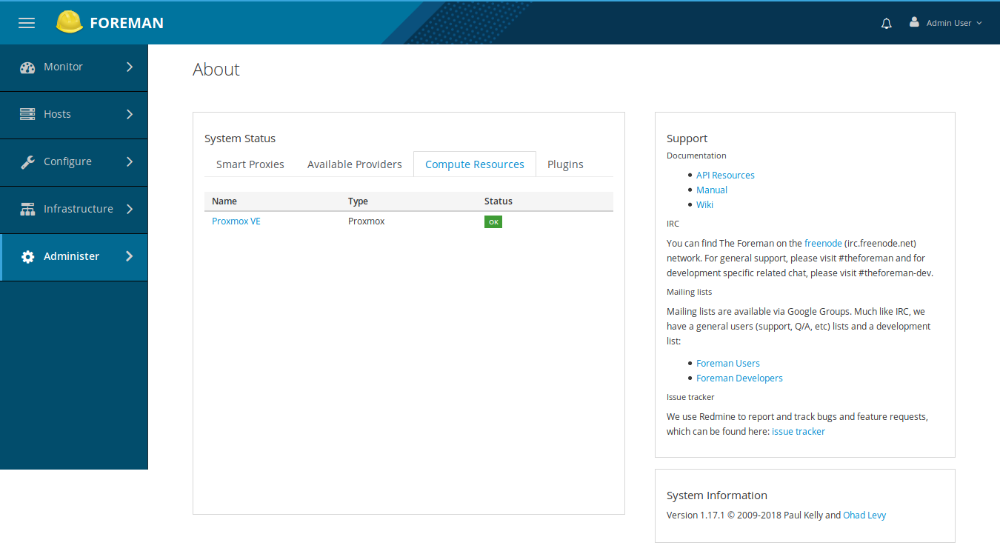
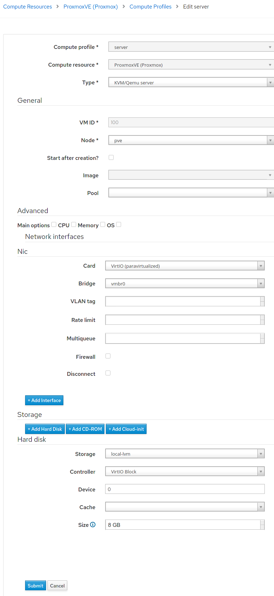

# Compute resource

## Create compute resource

You create a proxmox compute resource and set:

* the API REST URL, e.g: http://[host]:8006/api2/json
* user with sufficient privilegies to create vm with his realm, e.g: root@pam. Don't forget the @!
* user password
* if ssl_verify_peer, copy and paste the two cluster certificates: root and pve

Certificates can be copy and paste from your provider:

You can see vm associated with proxmox provider:

You can see it in about page:

You can see in welcome page this widget which shows node average load through time:

## Host group, profiles

To ease hosts management you can create a host group.

You can create profiles:

You can list profiles:

## Associated vms

You can list VMs associated to your proxmox compute resource:

## Associated images

You can list images associated to your proxmox compute resource:

