# Manage hosts

## Create

You first choose VM type between a container or a server.

The form automatically changes.

Server VM Proxmox config tab:

Advanced options could also be modified in Server VM Proxmox config tab.

Main options:

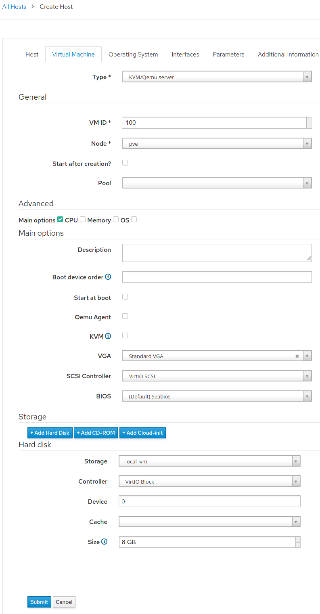

CPU options:

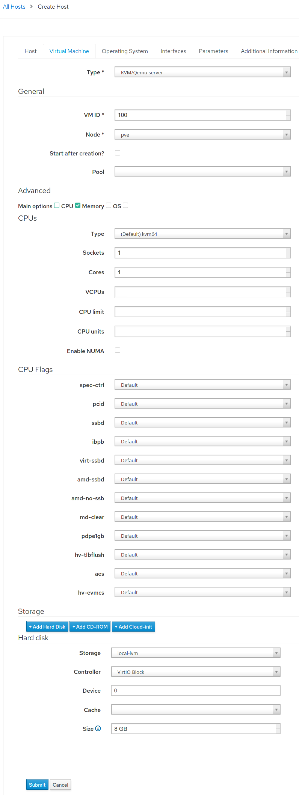

Memory options:

CDROM options:

OS options:

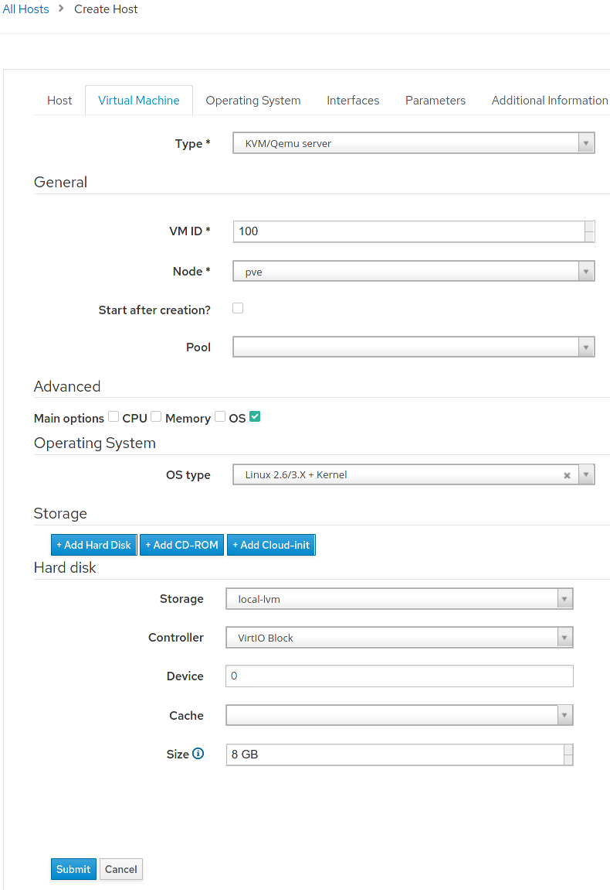

OS tab with build from network (default):

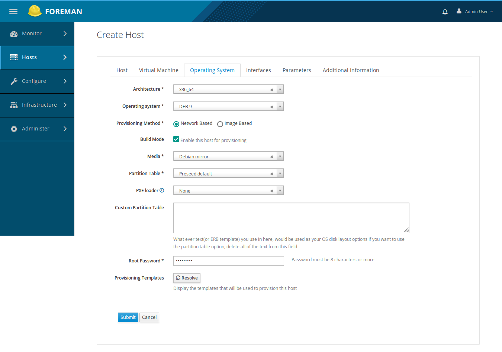

Network interface tab:

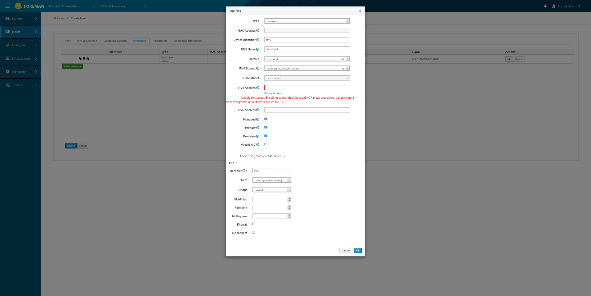

Identifier is required. You must set `net[n]` with n an integer.

The container form slightly differs from the server one.

Container VM Proxmox config tab:

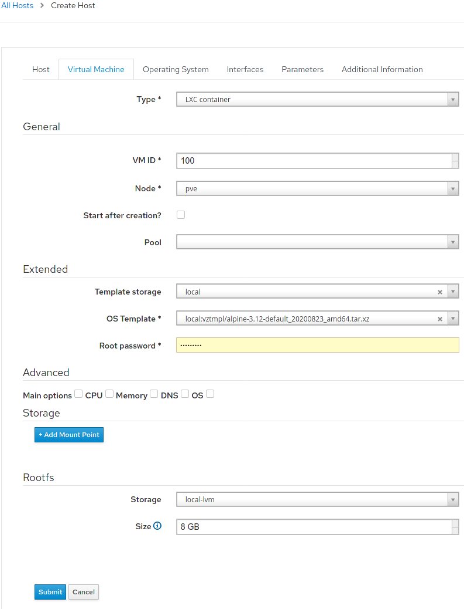

## Update

Update config is available.

## Clone images

You can also change a host (server or container) into an image, i.e. a [template](https://pve.proxmox.com/wiki/Qemu/KVM_Virtual_Machines#qm_templates) in Proxmox.
You update a host. You check the box `Create image?` to true and save it:

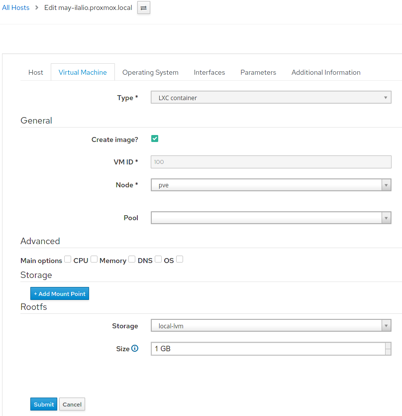

The image is then available in the list of the create image form.

You create an image from your compute ressource:

If previously you didn't created a template vm, the list of vmids is replaced by a single input:

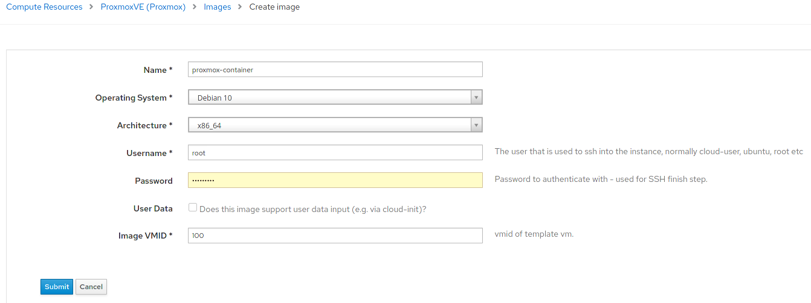

It is not recommended to create an image without a valid vmid template in proxmox.

Then you can make linked clones of this image. To do so, you create a new host and in OS tab you choose build from image and choose the available image:

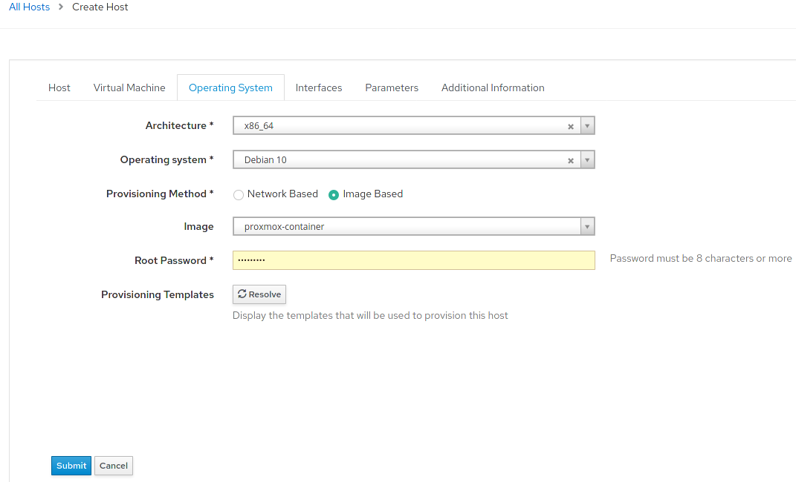

The the vm is cloned by proxmox in a new VM. The name starts with `Copy of image-name`.

## List hosts

You can list hosts in foreman:

And you can check it in Proxmox Web interface too:

## Show a host

VM (server) tab when vm is a template. `Templated?` is true:

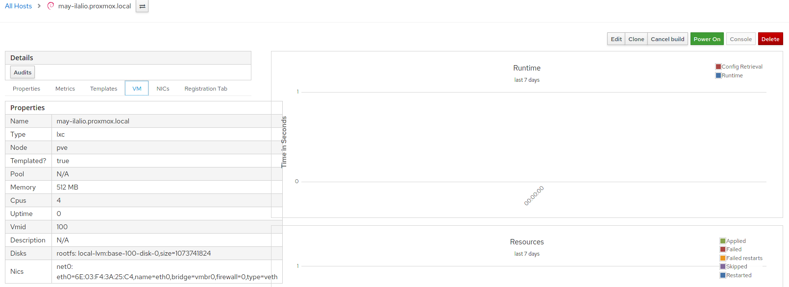

VM (container) tab when vm is not a template. `Templated?` is false:

## Start, stop VM

You can start and stop a vm:

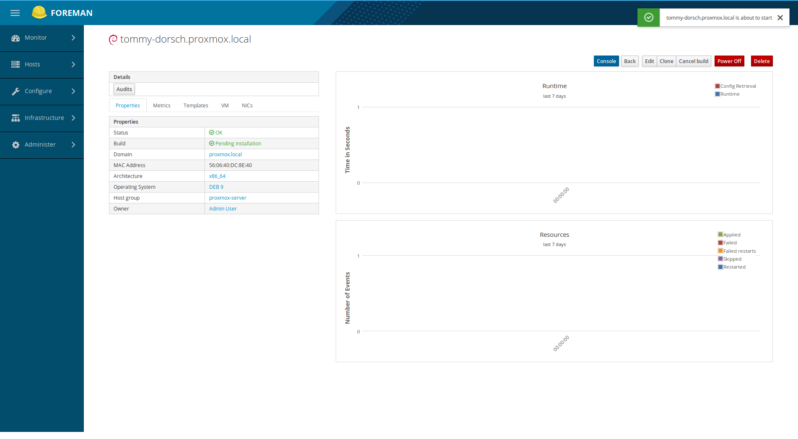

You can not run a template vm.

## Console

When vm is running, you can open a noVNC console on it:

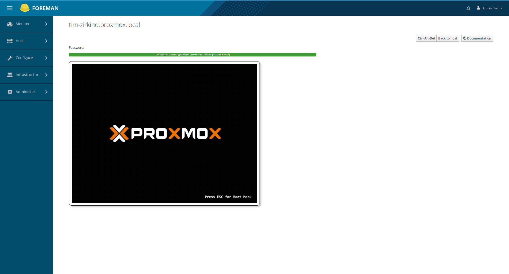

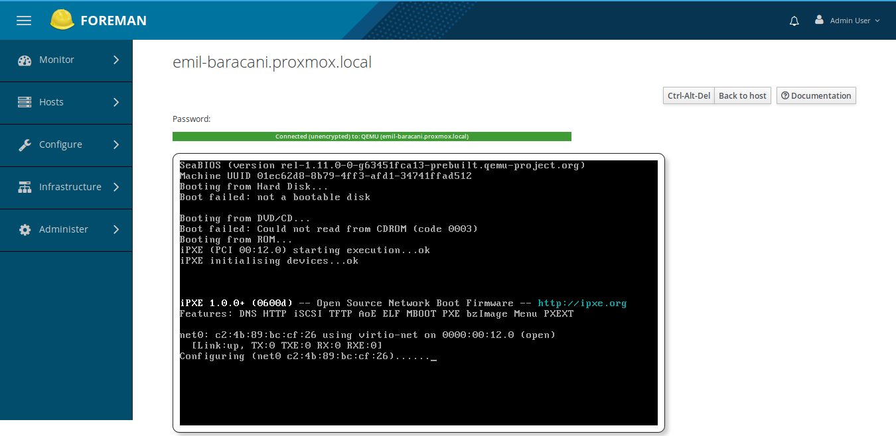