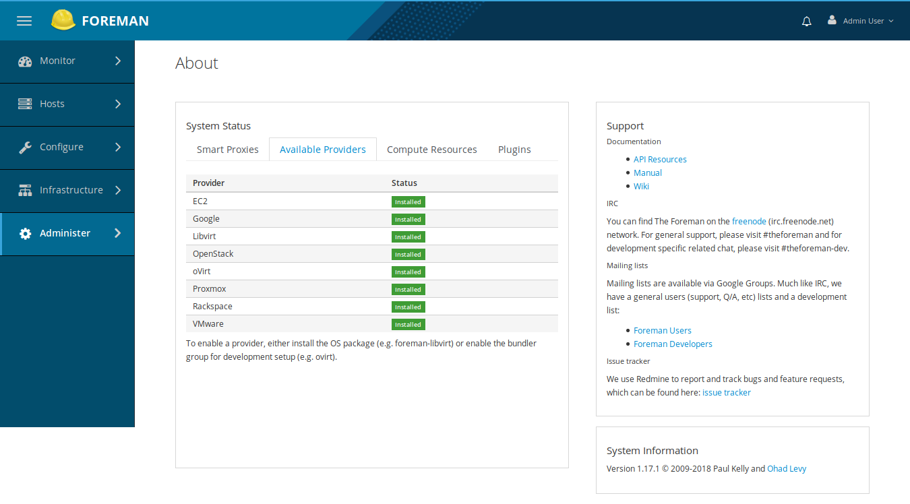

[](https://travis-ci.com/theforeman/foreman_fog_proxmox)
[](https://codeclimate.com/github/theforeman/foreman_fog_proxmox/maintainability)
[](https://codeclimate.com/github/theforeman/foreman_fog_proxmox/test_coverage)

# ForemanFogProxmox

[Foreman](http://theforeman.org/) plugin that adds [Proxmox](https://www.proxmox.com/en/proxmox-ve) compute resource: managing virtual machines and containers using the [fog-proxmox](https://github.com/fog/fog-proxmox) module.

It is intended to satisfy this [feature](http://projects.theforeman.org/issues/2186).

If you like it and need more features you can [support](SUPPORT.md) it.

## Compatibility versions

|Fog-proxmox|Proxmox|Foreman-fog-proxmox|Foreman|Ruby|
|--|--|--|--|--|
|<0.6|<5.3|<0.6|<=1.20|>=2.3|
|>=0.6|=5.3|>=0.6|=1.21|>=2.3|

## Installation

### Prerequisites

You need [nodejs](https://nodejs.org/en/download/package-manager/) installed in order to use foreman-assets package.

### From gem

See complete details in [plugin installation from gem](https://theforeman.org/plugins/#2.3AdvancedInstallationfromGems)

Here is a Debian sample:

* Install foreman [from OS packages](https://theforeman.org/manuals/1.19/index.html#3.3InstallFromPackages):

```shell
sudo apt install -y foreman foreman-compute foreman-sqlite3 foreman-assets
```

* Use only foreman user (**not root!**) `sudo -u foreman ...`
* In /usr/share/foreman/bundler.d directory, add Gemfile.local.rb file and add this line in it:

```shell
echo "gem 'foreman_fog_proxmox'" | sudo -u foreman tee /usr/share/foreman/bundler.d/Gemfile.local.rb
```

* Install the gem plugin:

```shell
sudo -u foreman /usr/bin/foreman-ruby /usr/bin/bundle install
```

* Precompile plugin assets:

```shell
/usr/bin/foreman-ruby /usr/bin/bundle exec bin/rake plugin:assets:precompile[foreman_fog_proxmox]
```

* Compile plugin translations if (french) needed :

```shell
/usr/bin/foreman-ruby /usr/bin/bundle exec bin/rake plugin:gettext[foreman_fog_proxmox]
```

* Complete installation of foreman 1.17+ with foreman-installer:

```shell
sudo apt install -y foreman-installer
sudo foreman-installer
```

If you don't want to have HTTP 503 errors when apt is trying to install puppetserver, then add this before launching foreman-installer:

```shell
echo 'Acquire::http::User-agent "Mozilla/5.0 (Linux)";' | sudo tee /etc/apt/apt.conf.d/96useragent
```

See complete details in [plugin installation from gem](https://theforeman.org/plugins/#2.3.2Debiandistributions)

Then you can check plugin installation after login into your new foreman server seeing the about foreman page:




### From OS packages

Please see the Foreman manual for complete instructions:

* [Foreman: How to Install a Plugin](http://theforeman.org/manuals/latest/index.html#6.1InstallaPlugin)

Redhat, CentOS or Fedora users should also [setup Selinux](https://projects.theforeman.org/projects/foreman/wiki/SELinux) to allow foreman and all its plugins to work.

## Usage

* [Compute resource](.github/compute_resource.md)
* [Manage hosts](.github/hosts.md)

## Development

### Prerequisites

* You need a Proxmox VE >= 5.1 server running.
* You need ruby >= 2.3. You can install it with [rbenv](https://github.com/rbenv/rbenv).
* You also need nodejs in your dev machine to run webpack-dev-server. You can install it with [nvm](https://github.com/creationix/nvm).

### Platform

* Fork this github repo.
* Clone it on your local machine
* Install foreman v1.17.3 or later on your machine:

```shell
git clone https://github.com/theforeman/foreman
git checkout tags/1.17.3
```

* Create a Gemfile.local.rb file in foreman/bundler.d/
* Add this line:

```ruby
gem 'foreman_fog_proxmox', :path => '/your_path_to/foreman_fog_proxmox'
gem 'fog-proxmox', :path => '/your_path_to/fog-proxmox' # optional if you need to modify fog-proxmox code too
gem 'ruby-debug-ide' # dev
gem 'debase' # dev
gem 'simplecov' # test
```

* In foreman directory, install dependencies:

```shell
bundle install --without libvirt postgresql mysql2
```

* Configure foreman settings:

```shell
cp config/settings.yaml.test config/settings.yaml
```

* Install foreman database (sqlite is default in rails development):

```shell
cp config/database.yml.example config/database.yml
bundle exec bin/rake db:migrate
bundle exec bin/rake db:seed
```

* You can reset admin password if needed:

```shell
bundle exec bin/rake permissions:reset
```

* You sholud write tests and you can execute those specific to this plugin:

```shell
export DISABLE_SPRING=true
bundle exec bin/rake test:foreman_fog_proxmox
```

* In foreman directory, after you modify foreman_fog_proxmox specific assets (proxmox.js, etc) you have to precompile it:

```shell
bundle exec bin/rake plugin:assets:precompile[foreman_fog_proxmox]
```

* In foreman directory, after you modify foreman_fog_proxmox translations (language, texts in new files, etc) you have to compile it:

```shell
bundle exec bin/rake plugin:gettext[foreman_fog_proxmox]
```

* In foreman directory, run rails server:

```shell
rails server
```

* In foreman directory, run in a new terminal the webpack-dev-server:

```shell
./node_modules/.bin/webpack-dev-server --config config/webpack.config.js
```

See details in [foreman plugin development](https://projects.theforeman.org/projects/foreman/wiki/How_to_Create_a_Plugin)

## Contributing

You can reach the [contributors](CONTRIBUTORS.md).
Bug reports and pull requests are welcome on GitHub at [ForemanFogProxmox](https://github.com/theforeman/foreman_fog_proxmox). This project is intended to be a safe, welcoming space for collaboration, and contributors are expected to adhere to the [Contributor Covenant](http://contributor-covenant.org) code of conduct.

Please read [how to contribute](CONTRIBUTING.md).

## License

The code is available as open source under the terms of the [GNU Public License v3](LICENSE).

## Code of Conduct

Everyone interacting in the ForemanProxmox project’s codebases, issue trackers, chat rooms and mailing lists is expected to follow the [code of conduct](CODE_OF_CONDUCT.md).
